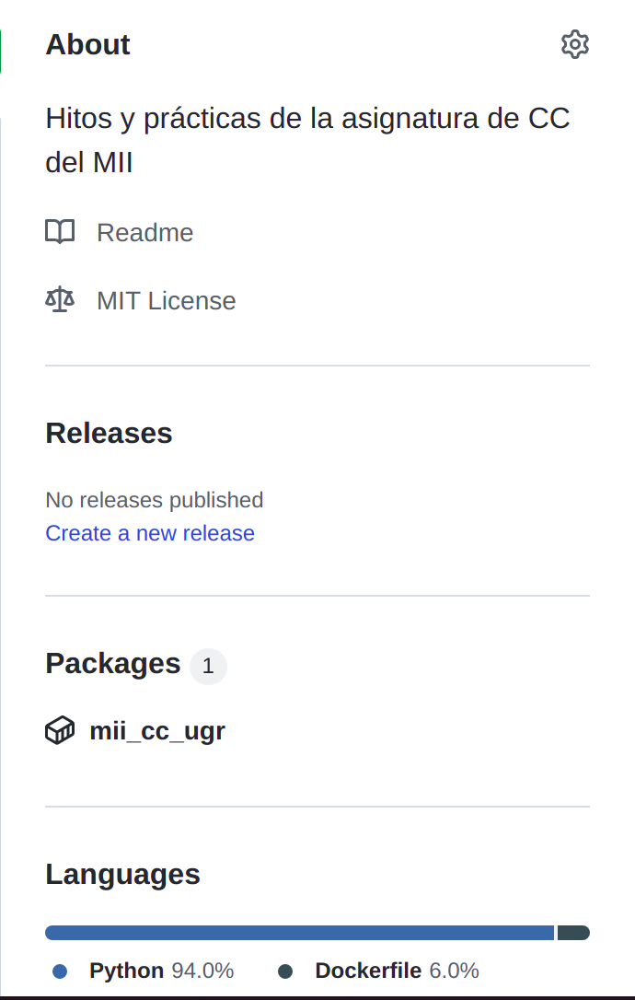

# Repositorio para la asignatura de Cloud Computing
- ⚙️ Para ver la configuración del repositorio, [clique en este enlace](doc/configuración.md)

- 📔 Para ver la explicación de mi proyecto, [clique en este enlace](doc/explicacionProyecto.md)

- Para visualizar las herramientas 🛠️ y el lenguaje🐍, [clique en este enlace](doc/herramientasYLenguaje.md)
- ☁️ Sistema en la nube, [¿Por qué?](doc/sistemaNube.md)

- 🦠 Herramientas para test, [¿qué he utilizado?](doc/test.md)

# Docker 🐋
## Contenedor base
Para realizar el docker para los test, se utilizará la imagen oficial de Python y como versión:
```python
  FROM pyhton:3.9-slim
```
Para ver la explicación de la elección, [pulse aquí](doc/estudioDockerfile.md)

## Docker Hub
Es un servicio de registro de repositorios, ligado a docker. Se puede alojar nuestro contenedor de test para el proyecto, automatizado con un [workflow](.github/workflows/latest.yml). De esta manera, nuestra imagen puede ser descargada en otro dispositivo, pudiendo ejecutar el proyecto sin necesidad de instalaciones extras.
Para acceder a mi imagen, puede realizarlo desde [aquí](https://hub.docker.com/repository/docker/jcgq/mii_cc_ugr)
## GitHub Container Registry
Se ha registrado en GitHub Container Registry, y para comprobarlo, puede [pulsar el enlace](https://github.com/jcgq/MII_CC_UGR/pkgs/container/mii_cc_ugr).

Se realiza un [workflow](.github/workflows/githubcr.yml) para actualizar los cambios de forma automática. El paquete creado y asociado a nuestro repositorio se encuentra en el [enlace](https://github.com/jcgq/MII_CC_UGR/pkgs/container/mii_cc_ugr).

Y, como vemos, tenemos un paquete asociado:


Para visualizar alternativas, [pulse aquí](doc/alternativasGCR.md)


# User Journey ✈️
Podrá leerlo en el siguiente enlace [Clique aquí](https://github.com/jcgq/MII_CC_UGR/wiki)

# Desarrollo y evolución
## Milestones
En el siguiente [enlace](https://github.com/jcgq/MII_CC_UGR/milestones) los hitos que se van a desarrollar en el proyecto.

## Issues y Users-stories
En el siguiente [enlace](https://github.com/jcgq/MII_CC_UGR/issues) puede visualizar las historias de usuarios y issues


