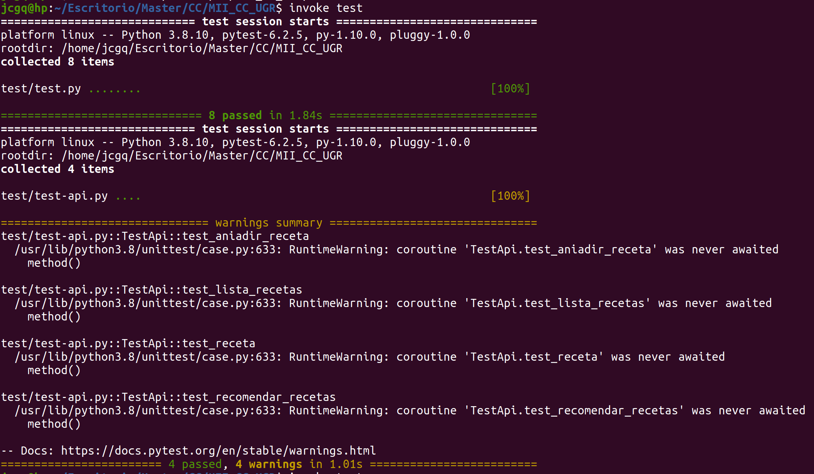

# Explicación del desarrollo seguido

- [HU1] Buscar receta: el usuario quiere obtener un conjunto de recetas que se obtienen a partir del sistema de recomendación, dado que tiene el nombre de una receta, los ingredientes que pueden aparecer y las calorías totales que no quiere superar.
```python
@post('/recomendacion')
def recomendacion():
```
Para este ejemplo, se utilizará un método post, para que a la hora del envío de la información, se pueda garantizar un formato correcto, y se puedan cumplir las restricciones de escritura.
Se devolverá fallo cuando el formato no sea correcto o no se encuentre ninguna lista de recetas porque los parámetros introducidos sean demasiado restrictivos.

- [HU3] Obtener recetas: como usuario, se me plantea una necesidad con respecto a la historia de usuario anterior. Aunque introducir una receta es opcional, ¿qué recetas hay en el sistema?, ¿cómo puedo yo decir que quiero algo similar a otra cosa, sin saber que ello está en el sistema?
Por lo tanto, dado que tiene el nombre de la receta, puede visualizarlas todas, y decidir a qué quiere ser similar.

```python
@get('/recetas')
def recetas():
```
Devolverá error si el sistema no contiene ninguna receta.
También, podrá comprobar una receta en concreto, dado que tiene el nombre de la misma:
```python
@get('/recetas<nombre>')
def recetas():
```
Devolverá error, si el nombre introducido no se encuentra en el sistema.

- [HU2] Añadir receta: como usuario, quiero añadir una receta, para obtener su índice calórico, dado que tiene el nombre, su eleboración, la lista de ingredientes y el tiempo empleado. De esta forma, también estaría ayudando a otros usuarios con su aportación.

```python
@post('/receta')
def crear_receta():
```
Devolverá error si el sistema no ha introducido una receta correcta.

- Error: Adicionalmente, se añadirá una función de error 404, por si el usuario añade una ruta que no se encuentra establecida en la API:

```python
@error(404)
def error_url(error):
	return '{"Error!" : "La ruta no existe","Recetas":"/recetas"}'
```

## Test Asíncronos
Una de las ventajas de [Bottle](https://github.com/bottlepy/bottle/issues/42), es que es un framework asíncrono, y teniendo en cuenta de que Python, está actualizando las características para que en su mayoría por defecto las acciones se realicen de froma síncrona, no es necesario el uso de "async" o de "await". 

Cuando se definen como test asíncronos, si se ejecutan, obtenemos el siguiente warning:


