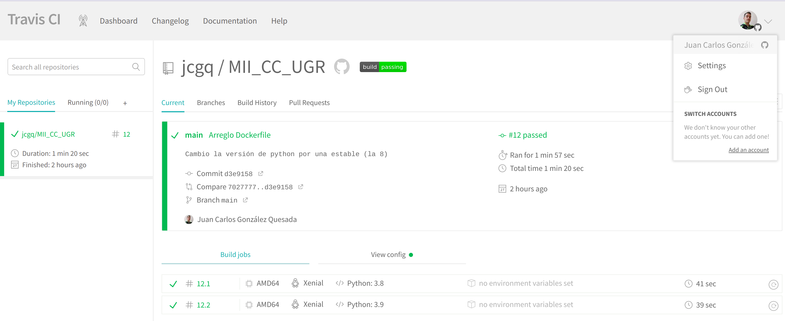
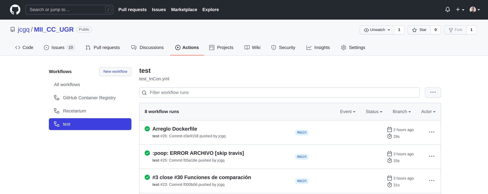
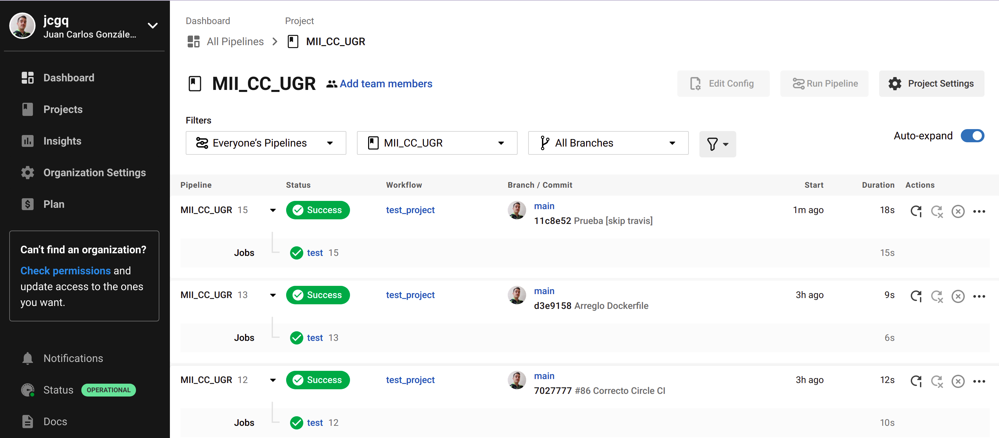

# Travis
Las ventajas para el uso de travis son:
 - Fácil de implementar, pues en pocas líneas se puede crear un archivo para pasar los test.
 - Integraciones asocaidas a GitHub. Por lo que podemos usar nuestro proyecto y docker ligados a nuestro proyecto.
Las desventajas, serían las siguientes:
 - Complejo de configurar a medida que los proyectos aumentan en complejidad
 - La confiabilidad y el tiempo de actividad se han convertido en un problema. De hecho, los planes han subido, es obligatorio introducir una tarjeta de crédito y los créditos pueden suponer un problema al final. A lo que se suma que hay 30 días de prueba.
 - Ya no es un líder en el espacio

## Versiones de Python
Al estar prácticamente algo "descuidado", las últimas versiones que están disponibles son:
- "3.6": No la podemos utilizar, porque no se podrían utilizar las buenas prácticas, por ejemplo, evitar la instalación de "pip"
- "3.7": Aparte de intestable, similar al anterior.
- "3.8": Es la que usaremos
- "3.9": Aunque es inestable, la usaremos como otra versión de python.
- "3.9-dev"  Aún en desarrollo, es inestable y no funcionan las buenas prácticas.
- "nightly"  Se encuentra en construcción (versión beta)

La versión 3.10 se encuentra en la arquitectura aarch64, sin embargo, como se comentó en la documentación de [docker](estudioDockerfile.md), no es posible instalar, por problemas de compatibilidad, el módulo de scipy, librería que se encuentra en sklearn. Por lo que, debemos también descartarla.

## Ejecución de los test
Aquí se muestra que los test han sido pasados sin ningún problema:

Para utilizar la imagen del docker, utilizaremos los siguientes sistemas:

# GitHub Action
Como hemos realizado anteriormente, estamos ligando el repositorio, con la imagen de docker con el propio github.
Y, ¿por qué utilizarlo?
Puesto que no requiere instalación, se consigue una CI totalmente asíncrona, utiliza los repositorios públicos y de uso público, y puedes decidir qué es lo que quieres testear. A lo que se suma, que no hay problemas en realizar muchas pruebas de test.

## Ejecución de los test

En este caso, es necesario que nos descarguemos la imagen de nuestro repositorio, sin usarlo directamente, puesto que nos ocurren varios errores:
- Busca una carpeta "__m/MII_CC_UGR/...", que no existe
- Si se crea, no tiene permisos para trabajar en ella.
- Si le intentas dar los permisos necesarios, no eres un usuario root
- Si intentas ser un usuario root, no te lo permite.

Con lo que intentamos, solo se ganaría reducir un total de 6 segundos en lso tests, por lo que el trabajo que hay que realizar, es más tedioso que el hecho de descargar la imagen.

---------------------------------------------------

Hemos estado comprobando que otras opciones podemos utilizar para usar otro ejemplo de integración contínua.

## Shippable
Ya no está disponible, así que esta opción, se descarta: [Shippable](http://docs.shippable.com/ci/overview/)

## Jenkins
Tiene varios inconvenientes, como que es necesario instalar la aplicación en el sistema, no es asíncrono. Es necesario que se ejecuta en una imagen docker, para ser compatible con el entorno y utiliza muchos plugging que dificultan la accesibilidad. [Jenkins](https://www.jenkins.io/)

# Circle CI
La creación de los WorkFlows es bastante similar a las de GitHub, por lo que se hace bastante similar. No es necesario el uso de ninguna tarjeta, y hay un plan gratuito, aunque con muchas restricciones.
Se enlaza con GitHub, el uso de créditos por test no es costoso y tiene una interfaz para los fallos muy intuitiva.
[CircleCI](https://circleci.com/)

## Ejecución de test

