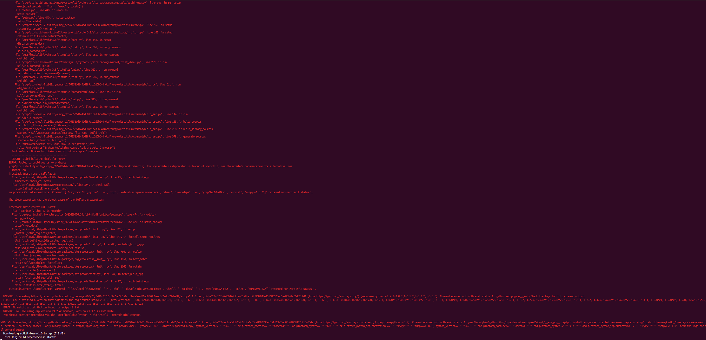

# Pruebas realizadas
## Ubuntu
Durante todo el proyecto de la asignatura, he realizado los test, las clases y el desarrollo del proyecto en Ubuntu, por ese motivo, crearemos una imagen en:

```Dockerfile
  FROM ubuntu:20.04
```
Nos aprovecharemos de que ya vienen con python instalado. Aunque el tamaño es algo grande y tenemos muchas librerías y funcionalidades que no vamos a utilizar.

El número de capas no es muy elevado:

Los test, se pasan en local correctamente:


## Python
Como mi proyecto, lo he realizado en Python, he investigado sobre algunas imágenes:
### Python
```python
  FROM pyhton:3.8-slim
  FROM python:3.9-slim-buster
  FROM python:3.9-slim
  FROM python:3.9-bullseye
```
Todas han requerido el mismo Dockerfile, pero el tamaño, no ha sido el más pequeño. De hecho, buster y bullseye rondaban la giga y media de tamaño.
Por lo que, a pesar de ser una buena opción, no se ha optado por ninguna de ellas. Motivo, por el que también se han descartado las versiones 10 y 11.
También se ha tenido en cuenta, la eliminación de ficheros o librerías, que solo son necesarias en el momento de la instalación de las dependencias como pip o el propio archivo de los requerimientos:

```Dockerfile
RUN python3 -m pip install --upgrade pip \
    && python3 -m pip install -r requirements.txt --no-cache-dir --no-warn-script-location
```
Cómo se explica en la parte principal, se decide utilizar python:3.9-slim, puesto que es la que menor tamaño proporciona:

Tamaño de las distintas imágenes


Visualización de Bullseye


Para la imagen python:3.9-slim, lo resultados son los siguientes:


El tamaño final una vez que se sube a DockerHub sería el siguiente:


### Pypy y Hylang
Se han descartado, porque aparte de dar varios errores en dependencias y librerías, no permite mucha reducción de capas y el tamaño no disminuye de forma considerable.
A lo que se suma, que tienen errores al cargar y trabajar con la librería de scikit-learn.

## Alpine
Se ha intentado trabajar con alpine, como imagen individual (en donde instalar Python) y como python:alpine.
Es similar a Ubuntu (aunque con algunos comandos diferentes [apk y no apt-get o useradd y no adduser]), a lo que se suma al mismo inconveniente que el apartado anterior y, aunque se ha solucionado con una versión antigua, luego tenía errores con scipy.

Para los dos errores, podemos visualizar los errores:
### Carga continua
Durante un buen rato, se queda cargando la librería sklearn:

### Error de funciones de instalación


### Librería 
Uno de los mayores problemas de nuestro tamaño de imagen, es debido a la instalación de la librería de sklearn, necesaria para poder comparar mediante tf-idf si la receta es similar a alguna que se encuentre en nuestro sistema.
Aquí podemos observar la diferencia de tamaño:
